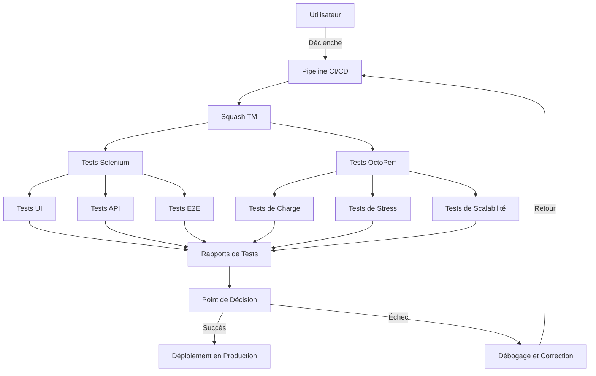

# Tests d'Intégration et de Performance

Voici un exemple de note principale sur les tests d'intégration et de performance.

Pour en savoir plus sur les tests de charge, consultez [cette note dédiée](note:Competences techniques/IntegrationTestFonctionnelsEtPerf/charge.md).

