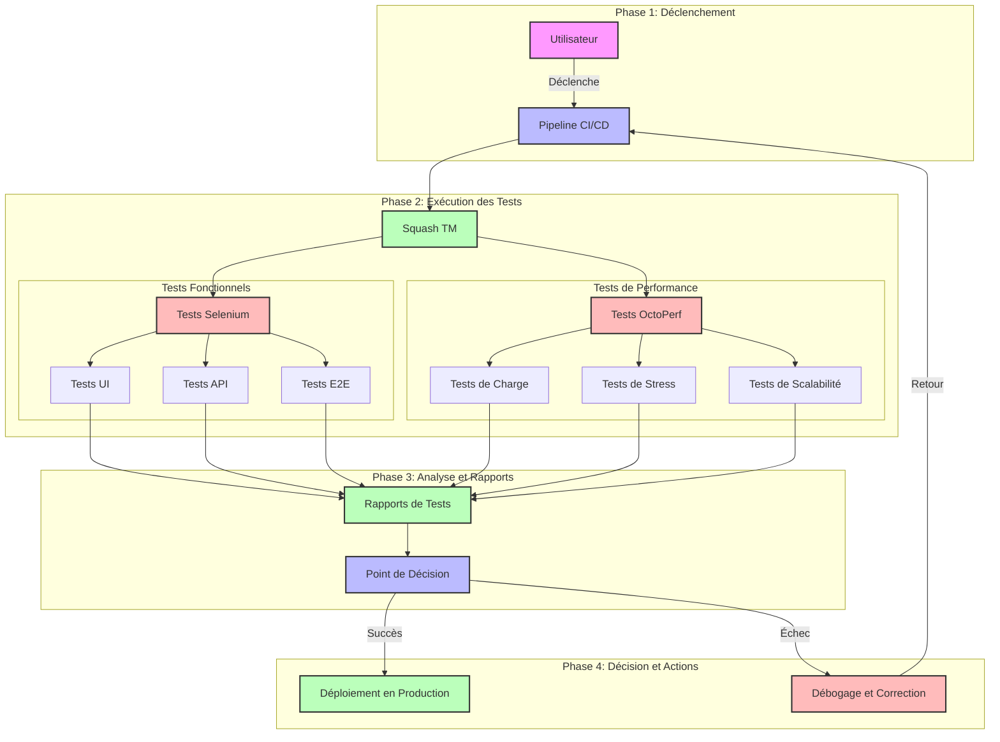

# Tests d'Intégration et de Performance

## Schéma du Flux de Travail

## Description des Composants

### Phase 1: Déclenchement
- **Utilisateur**: Déclenche le processus de test
- **Pipeline CI/CD**: Orchestre l'exécution des tests

### Phase 2: Exécution des Tests
- **Squash TM**: Gestionnaire de tests
  - **Tests Fonctionnels (Selenium)**
    - Tests UI: Interface utilisateur
    - Tests API: Points d'entrée API
    - Tests E2E: Scénarios complets
  - **Tests de Performance (OctoPerf)**
    - Tests de Charge: Performance sous charge normale
    - Tests de Stress: Performance sous charge extrême
    - Tests de Scalabilité: Capacité d'adaptation

### Phase 3: Analyse et Rapports
- **Rapports de Tests**: Consolidation des résultats
- **Point de Décision**: Évaluation des résultats

### Phase 4: Décision et Actions
- **Succès**: Déploiement en production
- **Échec**: Cycle de débogage et correction

## Métriques Clés
- Taux de réussite des tests
- Temps d'exécution
- Performance sous charge
- Taux d'erreurs
- Temps de réponse
